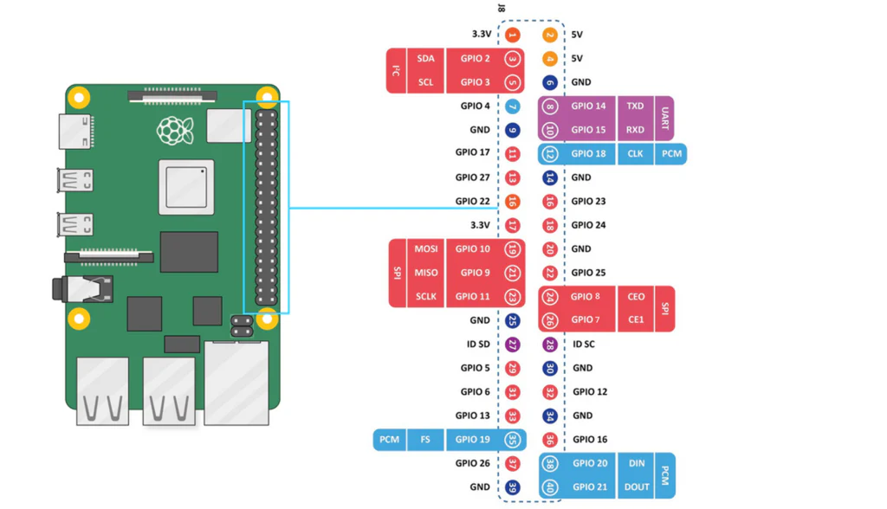

# Raspberry Pi 5 Arcade1up Hardmod
A collection of scripts and configs I use on my Yoga Flame cabinet RPi 5 hardmod.

## Features:
  - Off button (no on button)
  - Volume buttons
  - Marquee
  - Fixed theme (ckau-book) so it doesn't look weird in arcade1up's small screen

## Requirements
- Raspberry Pi 5
- Arcade1up cabinet
- Batocera v41+

## Setup
1. Copy the `system` folder to `/userdata/`, merge with existing `system` folder.
2. Reboot
3. Enable the 3 `a1u_*` services in `System Settings -> Services`.

## GPIO


In this readme I'll refer to the GPIO label, NOT the pin number, unless explicitly stated. For example, `GPIO2` is pin `3`.

### On/Off button
Connect ground to any ground (I'm using pin 6), button to `GPIO14`.

The Raspberry Pi 5 doesn't support turning it on through a GPIO pin anymore, so only the off button is supported.

You could populate the J2 jumpers and connect the button to it, just ensure you change the `line_offset` variable in `system/services/a1u_pwr_btn` to `20` so it uses `GPIO20` ([ref](https://forums.raspberrypi.com/viewtopic.php?t=372360)). I haven't tried it myself so I can't attest to it working.

### Volume buttons
This button is still quite flaky, but it works if you try enough times.

Connect ground to any ground (I'm using pin 14), volume up to `GPIO23`, volume down to `GPIO24`.
You might have to play around with the cables so the buttons are connected to the correct pins.

### Marquee
See [FlanFanTV: Arcade1up Stock Light-Up Marquee w/ Raspberry Pi](https://www.youtube.com/watch?v=s2iMBXck1Uc) for setup.

### Theme (ckau-book)
Edit `system/themes/ckau-book/theme.xml` last line so it looks like this:
```diff
- </theme>
+   <include>./override.xml</include>
+ </theme>
```
Ensure you're not editing anything else in the file (including auto-formatting).


## TODO:
  - Add schematics for marquee
  - On button

## Credits
  - [FlanFanTV](https://www.youtube.com/@FlanFanNetwork) for the marquee setup tutorial.
  - [CkauNui](https://github.com/CkauNui) for the excellent theme.
  - [Vilros](https://vilros.com/pages/raspberry-pi-5-pinout) for the Raspberry Pi 5 pinout image.
